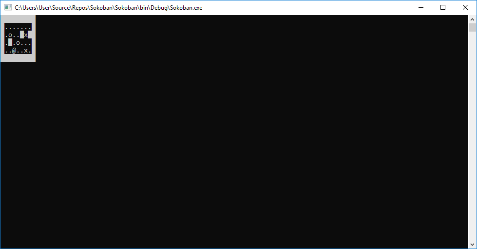

# Sokoban
by Bram-Boris Meerlo and Peter-Jan Gootzen for a Data Structures assignment for Avans Hogeschool

## Screenshots

## Controls
Arrows keys control the player(@)
Press the *o* key whilst playing to open a level

## Game rules
Your objective is get all the boxes(o) on the designated spots(x), the level is completedwhen all boxes(o) are on a spot(x).

## Flaw in the data structure
The Presentation layer knows about the internal structure of the Model layer. 
The fix is to have each model have a GetChar() method(via an interface), then the CLI class can simply itterate over every item and call and print it's character. This results in CLI class printing the whole gamescreen without having any knowledge about the Model layer.
This flaw has been fixed in the successor of this assignment [Goudkoorts](https://github.com/Peter-JanGootzen/Goudkoorts "Goudkoorts")